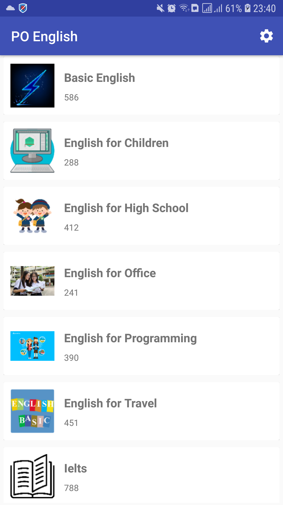
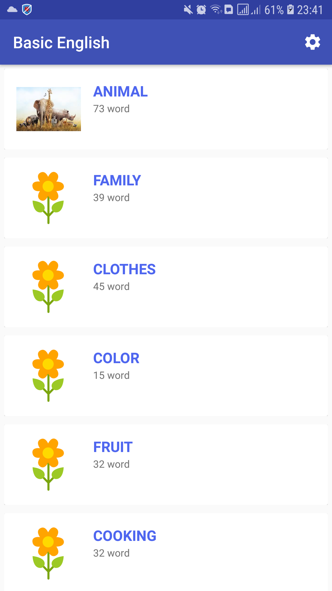
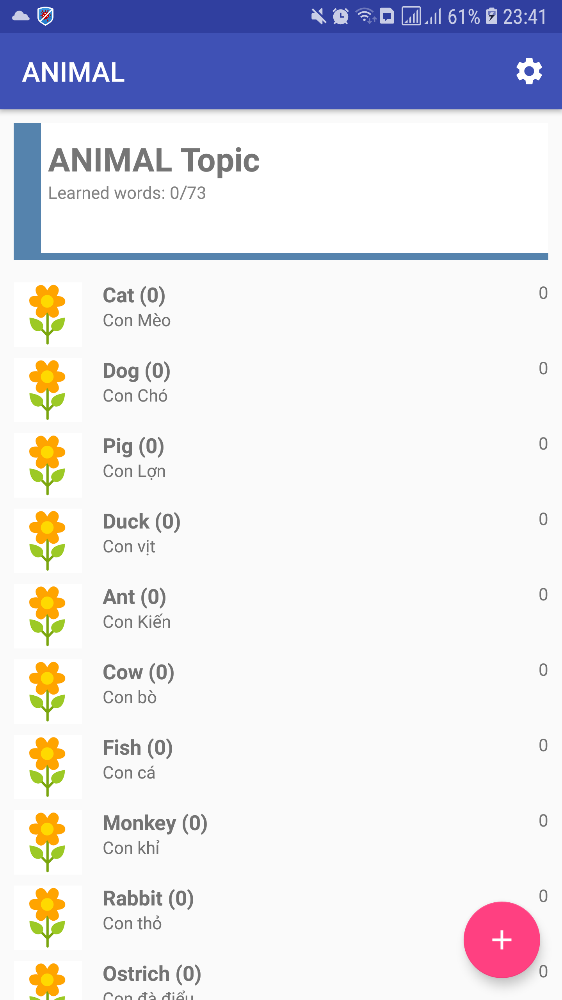
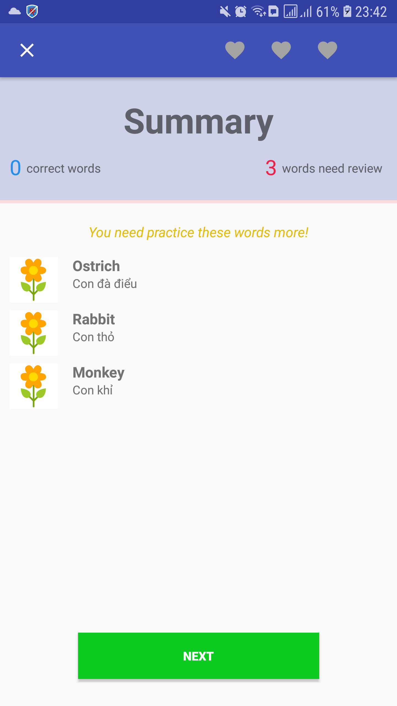
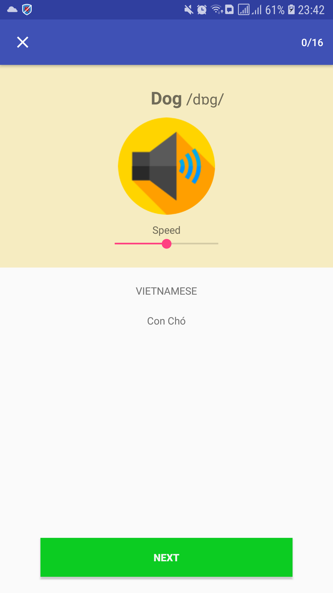
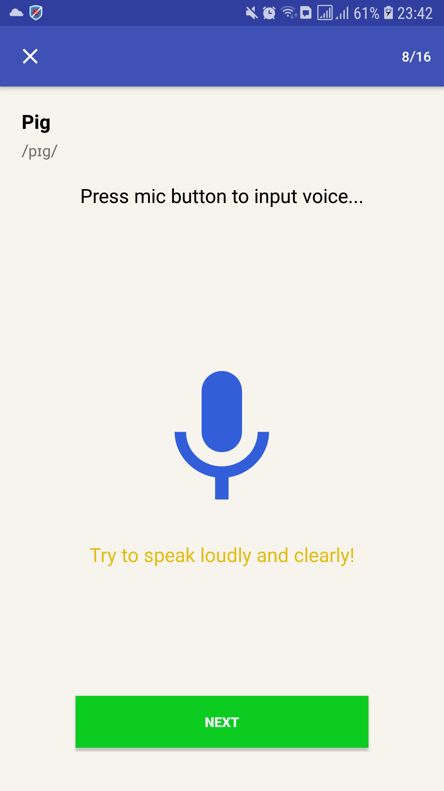

# po-english
English learning application for vietnamese

# GUI

# Install
* Android studio: https://r1---sn-42u-i5oll.gvt1.com/edgedl/android/studio/install/4.0.1.0/android-studio-ide-193.6626763-windows.exe?cms_redirect=yes&mh=Aa&mip=118.71.1.40&mm=28&mn=sn-42u-i5oll&ms=nvh&mt=1595511434&mv=m&mvi=1&pl=24&shardbypass=yes

